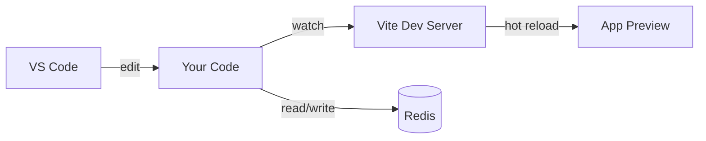

# Welcome to the Iris Kind workbench

This pack proves the workshop shell on Kind: Docsify, in-browser VS Code,
Vite, and Redis Insight. Redis is the `workshop` Redis Enterprise database,
not OSS Redis in Compose.

## What You'll Learn

- How to edit code in a web-based IDE (VS Code)
- HTML, CSS, and JavaScript fundamentals
- How to use Vite for fast development
- Modern web development workflow

## How It Works

1. **Edit code** in VS Code
2. **Save your changes** (Ctrl+S or Cmd+S)
3. **See updates instantly** in your app

The app uses **Vite** which provides instant hot module replacement - your changes appear without refreshing!

## Workshop Architecture

Here's how the pieces fit together:



## Sample Code

Here's a taste of what you'll be writing. This snippet connects to Redis and stores a value:

```javascript
import { createClient } from 'redis';

const client = createClient({ url: process.env.REDIS_URL });
await client.connect();

await client.set('greeting', 'Hello from the workshop!');
const value = await client.get('greeting');

console.log(value); // Hello from the workshop!
```

## Getting Started

Ready to begin? Head to the [Setup Guide](setup/setup.md) to get oriented, then start with [Task 1](tasks/task-1.md).

---

**Need help?** Check the [Reference](reference/reference.md) section for helpful resources.

